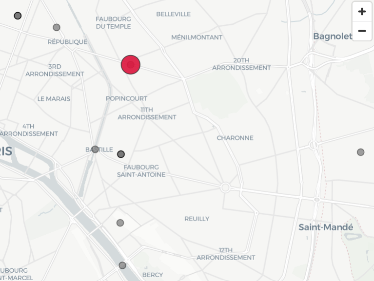

# Application VIDOCQ (VIsualisation de DOCuments par Questionnement)

L'application VIDOCQ propose différents visuels destinés à appréhender de façon rapide un corpus de documents.

Actuellement, l'application propose quatre fonctionnalités principales :

---

### **1. Recherche de concepts dans un corpus de documents et visualisation par graphe dynamique**

L'utilisateur importe un corpus de documents (fichiers .txt pour le moment, à venir : .csv et .pdf), renseigne des concepts par des mots-clés séparés par des virgules. Il choisit également une méthode de recherche, et ajuste les valeurs des paramètres de cette méthode.  
Un graphe apparait alors, composé de deux types de nœuds : les documents et les concepts.  
Un nœud-concept et un nœud-document sont reliés par une arête si et seulement si ce concept apparaît dans ce document.  

Ce graphe est **dynamique** : il est possible de déplacer ses nœuds, d’agir sur la taille des arêtes, etc.  
Le graphe peut être sauvegardé au format `.html` (version interactive) ou `.png` (version statique).

  

---

### **2. Word cloud d'un corpus de documents**

L'utilisateur importe un corpus de documents (fichiers .txt pour le moment, à venir : .csv et .pdf), puis sélectionne un document dans ce corpus.  
Un **nuage de mots** apparaît, permettant une vision synthétique du texte.  
Le nombre de mots affichés est ajustable. Un prétraitement du texte (tokenisation, suppression des stop words, stemming, lemmatisation) permet d’éliminer les mots non signifiants et les redondances (“ami/amies”, “détection/détecter”, etc.).

  

---

### **3. Synthèse d'événements**

L'utilisateur choisit un fichier dans le corpus initialement chargé.  
En sélectionnant l'option de visualisation **“Synthèse”**, l’application affiche une **extraction structurée d’événements**, sous la forme de blocs successifs à quatre items :

- un item *Événement* qui résume brièvement une action ou un fait relaté dans le texte,  
- un item *Lieu* qui précise le lieu où s’est déroulé cet événement,  
- un item *Moment* qui précise la date, l’heure ou le contexte temporel,  
- un item *Individus* qui précise les personnes impliquées.

  

---

### **4. Carte d'événements**

L'utilisateur choisit un fichier dans le corpus initialement chargé.  
En sélectionnant l'option **“Carte”**, une carte **OpenStreetMap** apparaît, affichant des points rouges correspondant aux **localisations des événements** extraits du texte.

  

Lorsqu’on clique sur un point rouge, une fenêtre affiche les détails de l’événement (résumé, lieu, moment, individus).  
Si plusieurs événements se sont déroulés au même endroit, tous apparaissent dans cette fenêtre.

  

Une **version dynamique** est également disponible : la carte peut être animée, globalement ou individuellement (par personne).  
Le marqueur rouge se déplace alors selon la chronologie des faits extraits.

  

---

## 🧠 Méthodologie d’extraction des événements

L’extraction des faits repose sur une **pipeline d’analyse sémantique** articulée en plusieurs étapes, orchestrée dans le module `extraction_structuree.py`.

### 1️⃣ Découpage du texte
Chaque document (.txt) est d’abord **découpé automatiquement** en blocs de ~2000 caractères (avec un léger chevauchement).  
Cette segmentation garantit un bon équilibre entre **contexte sémantique** et **limite de tokens**.

### 2️⃣ Appel à un modèle de langage (LLM)
Les blocs de texte sont ensuite envoyés à un **modèle de la famille LLaMA 3**, via l’API **Groq**, un service distant compatible OpenAI.  
Deux modèles sont utilisés :

| Modèle | Taille | Type | Lieu d’exécution | Rôle principal |
|---------|---------|------|------------------|----------------|
| `llama-3.1-8b-instant` | 8 milliards de paramètres | **LLM distant (Groq)** | Cloud Groq | Extraction rapide et peu coûteuse |
| `llama-3.3-70b-versatile` | 70 milliards de paramètres | **LLM distant (Groq)** | Cloud Groq | Extraction plus fine et robuste |

Ces modèles ne tournent **pas localement** : les requêtes sont envoyées à l’API Groq via une clé (`groq_key.txt`).  
La configuration est compatible OpenAI (`base_url="https://api.groq.com/openai/v1"`).

### 3️⃣ Extraction structurée au format TSV
Le modèle reçoit un **prompt d’instructions** lui demandant d’extraire tous les faits du texte sous un format strict à 4 colonnes séparées par des tabulations :

résumé lieu moment individus

Le LLM doit respecter scrupuleusement ce format et ne renvoyer **aucun texte hors des marqueurs**.  
Chaque ligne correspond à un fait élémentaire, par exemple :

Accident de voiture rue Victor Hugo, Lyon 12 mai 2024 - 17h15 Paul Martin; Claire Dubois

### 4️⃣ Parsing et stockage
Le texte renvoyé est analysé, nettoyé, et converti en un **DataFrame pandas**.  
Un mécanisme de **checkpoint** permet de sauvegarder les résultats au fur et à mesure, afin de reprendre le traitement en cas d’interruption.

Les données finales sont exportées sous forme de fichiers `.tsv` :
- `checkpoint_faits.tsv` (résultats intermédiaires)
- `faits_extraits.tsv` (résultats finaux)

### 5️⃣ Visualisation
Les événements extraits alimentent directement les modules de **synthèse**, **graphe** et **cartographie**, offrant une lecture simultanée :
- spatiale (sur carte),
- temporelle (bientôt en timeline),
- relationnelle (graphe de co-occurrence).

---

## 🚧 A venir

- **Visualisation par timelines** : représentation chronologique des événements.  
  Applications possibles :
  - détection d’incohérences (présence simultanée d’un individu sur deux lieux distincts),
  - repérage de schémas comportementaux ou de répétitions d’événements.

- **Exploration d’images satellitaires** :  
  - surveillance d’infrastructures (routes, aéroports, ports, etc.)  
  - suivi logistique et observation de flux  
  - détection de changements dans le temps (comparaison multi-temporelle)

- **Extensions prévues :**
  - support de nouveaux formats (.csv, .pdf)  
  - validation manuelle des entités (individus, lieux, dates) par l’utilisateur  
  - interface plus flexible et paramétrable

