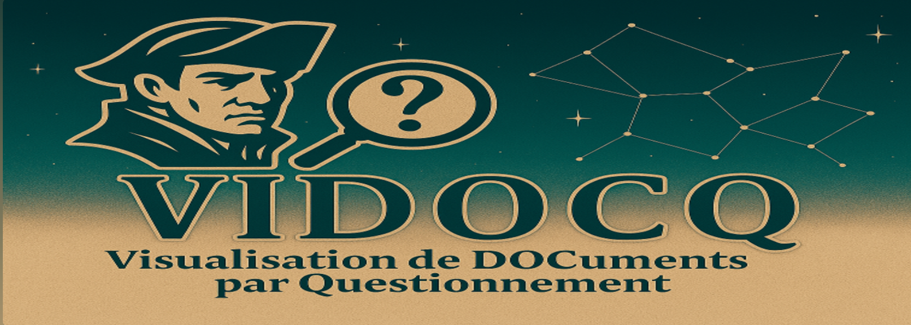
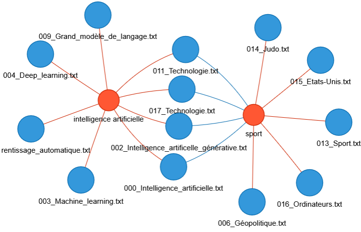
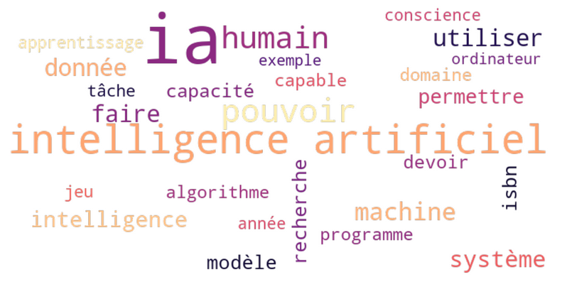
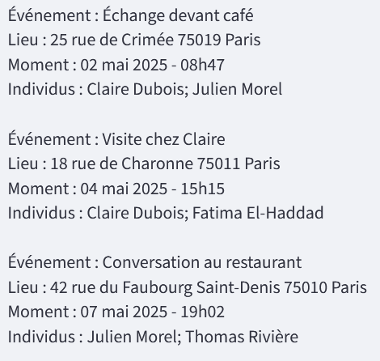
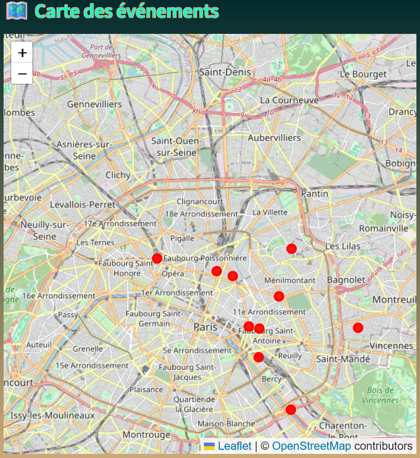
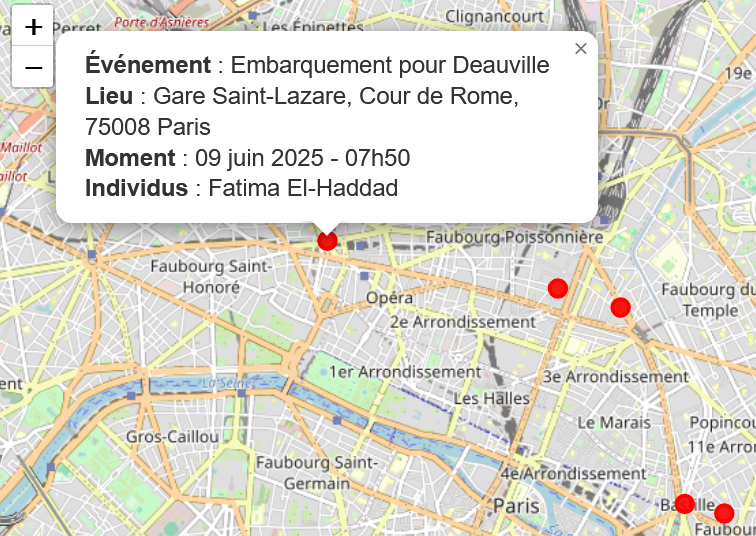

# Application VIDOCQ (VIsualisation de DOCuments par Questionnement

L'application VIDOCQ propose différents visuels destinés à appréhender de façon rapide un corpus de documents.

Actuellement, l'application propose deux fonctionnalités :

**1. Recherche de concepts dans un corpus de documents et visualisation par graphe dynamique** 

L'utilisateur importe un corpus de documents (fichiers .txt pour le moment, à venir : .csv et .pdf), renseigne des concepts par des mots-clés séparés par des virgules. Il choisit également une méthode de recherche, et ajuste les valeurs des paramètres de cette méthode. Un graphe apparait alors, composés de deux types de noeuds : les documents et les concepts. Un noeud-concept et un noeud-document sont reliés par une arête si et seulement si ce concept apparaît dans ce document. Ce graphe est dynamique, il est possible de déplacer ses noeuds, agir la taille des arêtes etc. Il est possible de le sauvegarder au format .html (pour une version dynamique) ou .png (pour une version statique).

  

**2. Word cloud d'un corpus de documents**

L'utilisateur importe un corpus de documents (fichiers .txt pour le moment, à venir : .csv et .pdf), sélectionne un document dans ce corpus. Un nuage de mots apparaît, permettant une vision syntéhtique du texte.Le nombre de mots du nuage est ajustable. Un prétraitement du texte (tokenisation, stop words, stemming, lemmatisation) permet de supprimer les mots non signifiants ("la", "le", "des", "avec", "et", etc.) et les redondances ("ami" et "amies", "détecter", et "détection" etc.). 

  

**3. Synthèse d'événements** 

L'utilisateur choisit un fichier dans le corpus initialement chargé. En sélectionnant l'option de visualisation "Synthèse", on voit apparaître une extraction structurée d'événement sous la forme de blocs successifs à 4 items :

- un item *Evénement* qui résume en quelques mots un événement relaté dans le fichier importé
- un item *Lieu* qui précise le lieu où s'est déroulé cet événement
- un item *Moment* qui précise le moment auquel cet événement s'est déroulé
- un item *Individus* qui précise les individus impliqués dans cet événement

  

**4. Carte d'événements**

L'utilisateur choisit un fichier dans le corpus initialement chargé. En sélectionnant l'option de visualisation "Carte", on voit apparaître une carte OpenSteetMap. Sur cette carte, figurent des points rouges qui correspondent aux localisations des différents événements mentionnés dans le document. 

  

Lorsque l'utilisateur clique sur l'un de ces points rouges, une petite fenêtre apparaît à côté. Cette fenêtre comporte un résumé de l'événement, le lieu de l'événement, le moment de l'événement, et les individus impliqués dans l'événement. Si plusieurs événements se sont déroulés au même lieux, alors la fenêtre mentionne tous ces événements en précisant tous les items correspondants.

  

**A venir :** 

- **Implémentation de nouvelles fonctionnalités :**

  - **visualisation par timelines :** les événements extraits sont représentés par une frise chronologique.
 
  Ces visualisations peuvent avoir des applications intéressantes :

    - détection d'incohérences sur les dates ou les lieux mentionnés (individus présents simultanément sur deux lieux distants par exemple)
    - détection de patterns (événements ou comportements réccurents par exemple)
 
- **exploration d'images satellitaires :** les applications sont nombreuses :

  - surveillance d'infrastructures : routes, aéroports, gares etc.
  - analyse de routes et flux logistiques : observation d'axes d'acheminement maritime, terrestre ou fluvial
  - différences d'images : la comparaison d'images d'une même zone observée à des moments différents permet de détecter de potentiels changements
    

 - **Améliorations et extensions des fonctionnalités existantes :**
   
   - **extension à d'autres formats de fichiers** : pour le moment seuls les fichiers .txt sont autorisés. Ultérieurement, l'utilisateur pourra aussi charger des .csv et des .pdf
   - **renforcement de la liberté de l'utilisateur :** il est prévu que l'utilisateur puisse valider ou invalider certaines informations du corpus, comme les éléments identifiant les individus (nom, prénom etc.),     les lieux, etc. L'idée est de créer un outil flexible et que l'utilisateur puisse toujours avoir le dernier mot.

